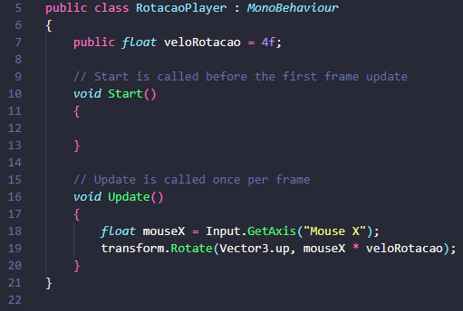
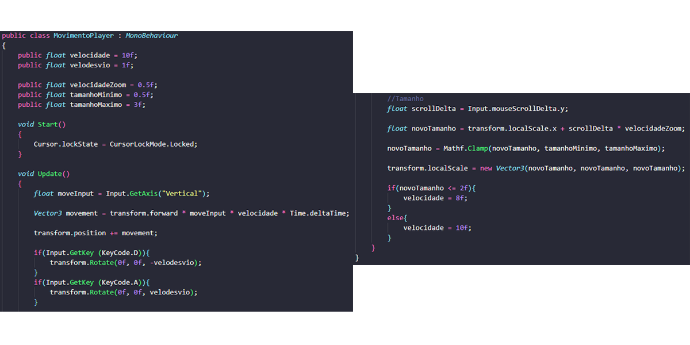
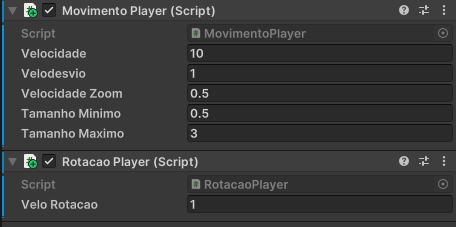

# Explicando a cena 3D feita no Unity

## Link do projeto
https://drive.google.com/file/d/1wxk1mJCovWtCaSKyqWLTAIeoOEUvWlcu/view?usp=sharing

## Sobre a Cena

<b>Cena feita por: Cauã Silva e Carlos Alarcon.</b>

A cena se baseia em um carro que deve fugir de uma pedra que está rolando em sua direção, porém não é tão simples, o carro precisa desviar de diversos obstáculos indo para os lados, diminuindo seu tamanho e tomando cuidado para não capotar. No final, o carro irá visualizar uma virada que servirá para ele desviar da pedra, assim sobrevivendo e vendo a pedra passar reto. O jogador irá controlar o carro, suas mecânicas são:

## Desenvolvimento da criação da Cena

  

Para a criação da cena, foram utilizados diversos GameObjects. São eles:

<ul>
    <li>Cubes</li>
    <li>Sphere</li>
    <li>Main camera</li>
    <li>Directional Light</li>
    <li>Point Light</li>
    <li>Spot Light</li>
    <li>Paredes "invisíveis"</li>
    <li>Assets</li>
    <li>Objetos feitos no Blender</li>
</ul>

O que mais utilizamos foram os Assets, que foi o principal na formação da nossa cena. Os Assets são as árvores, pedras e montanhas, que são bem espalhadas pela cena; Os templos que foram utilizados como decoração da cena; Os obstáculos de rua; Por fim o nosso personagem que é o carro.

O cubo foi utilizado para fazer os pisos e as laterais da estrada onde se passa a cena.

A sphere foi utilizada para fazer a pedra que irá perseguir o carro e para decorações.

O point light foi utilizado para ser um ponto de luz no túnel que foi feito pelo blender.

Foram criados dois spot lights que são os faróis do carro.

Por fim as paredes "invisíveis" foram criadas para que o jogador(carro) não saia da parte principal da cena.

### Materiais e textura

Os materias foram usados para adicionar texturas aos nossos objetos, nele podemos adicionar imagens de textura ou cores, na nossa cena adicionamos ambos. Aqui estão alguns exemplos de objetos com os materiais:

 

Além deles, todos os Assets adicionados já vem com seus materiais a parte.

### Box Collider, Sphere Collider e RigidBody
#### Exemplo:

  

O box collider foi adicionado nos pisos, no carro(personagem), nos obstáculos e nas laterais e paredes "invisíveis". Ele foi adicionado com a função de fazer com que os objetos não se atravessem, como esse será um jogo onde o carro deverá desviar dos obstáculos enquanto é perseguido por uma pedra, o box collider é essencial. Como mostra a imagem, o box collider é uma caixa de colisão em volta do objeto. Já o sphere collider, como diz o nome, serve para objetos redondos e é uma esfera em volta do objeto, e foi adicionada em todas as sphere adicionadas na cena, mas a principal é a pedra que persegue o carro.
 

O RigidBody serve para adicionar os conceitos de física à determinado objeto. Ele foi adicionado ao carro(personagem) e aos obstáculos fazendo assim com que consigam colidir e que fiquem parecidos com a realidade. O único elemento alterado no RigidBody foi o Mass que é a massa do objeto, colocamos uma massa baixa para o carro e uma massa alta para os obstáculos.

### Scripts

Foram criados 3 scripts, um chamado "MovimentoPedra" que faz a pedra se movimentar sozinha para frente.
 

Outro chamado "RotacaoPlayer" que rotaciona o carro no eixo Y ao mover o mouse para direita ou esquerda.

Por fim um chamado "MovimentoPlayer" que é o mais complexo, nele possui o movimento do carro, o descapotamento (inclinação para direita ou esquerda) e a função que faz com que o carro mude de tamanho. Foi necessário colocar o de tamanho e de movimento juntos, pois no final do script foi feito uma lógica para que se o carro ficasse pequeno a velocidade dele ficaria menor. 

### Explicação mais detalhada de cada script:
<dl>
    <dt>Script de <b>movimentação da pedra</b>:</dt>
     
        
     
         
        <dd>A variável velocidade é usada para definir a velocidade de movimento da pedra. Quanto maior o valor da velocidade, mais rápido a pedra ira se mover. Dentro do método Update, que é chamado a cada quadro, temos o código responsável por mover a pedra para frente. A função transform.Translate é utilizada para realizar o deslocamento do objeto. "Vector3.forward" é um vetor que representa a direção para a frente no espaço tridimensional do Unity. Multiplicando esse vetor pela velocidade e pelo Time.deltaTime, garantimos que o movimento seja suave e independente da taxa de quadros.</dd>
</dl>
 
<dl>
    <dt>Script de <b>rotação do player</b>:</dt>
     
        
      
        <dd>A variável veloRotacao é usada para definir a velocidade de rotação do objeto. Quanto maior o valor da velocidade de rotação, mais rápido o objeto irá girar. Dentro do método Update, temos o código responsável por obter a entrada do movimento do mouse na horizontal (Mouse X). A função Input.GetAxis é utilizada para obter o valor da entrada do movimento do mouse na direção horizontal. Em seguida, utilizamos a função transform.Rotate para rotacionar o objeto em torno do eixo vertical Y (Vector3.up). O valor obtido da entrada do movimento do mouse (mouseX) é multiplicado pela velocidade de rotação (veloRotacao), determinando a direção da rotação.</dd>
</dl>
 
<dl>
    <dt>Script player:</dt>
        
        <dt>Método Start</dt>
            <dd>Dentro do método Start, é utilizado um código que faz com que bloqueie o cursor do mouse, fazendo assim com que ele não fique aparecendo ao inciar a cena.</dd>
        <dt>Script de <b>movimentação do carro</b>:</dt>
            <dd>A variável velocidade é utilizada para definir a velocidade de movimento do carro. Usamos a função Input.GetAxis para obter a entrada do movimento vertical e, em seguida, calculamos o vetor de movimento multiplicando a direção para frente do objeto (transform.forward) pelo valor de moveInput, a velocidade e Time.deltaTime. Em seguida, usamos "transform.position += movement" para atualizar a posição do objeto de acordo com o vetor de movimento. W irá fazer o carro ir para frente e S irá fazer o carro ir para trás, pois é o padrão do unity.</dd>
        <dt>Script de <b>inclinação do carro</b>:</dt>
            <dd>A variável velodesvio é utilizada para definir a velocidade de rotação do carro no eixo Z. Foram utilizados if e else para que se a tecla apertada for "A", o carro irá inclinar para esquerda, e se a tecla apertada for "D" o carro irá inclinar para direita.</dd>
        <dt>Script de <b>tamanho do carro</b>:</dt>
            <dd> A variável velocidadeZoom define a velocidade com que o objeto muda seu tamanho quando o scroll do mouse é girado. As variáveis tamanhoMinimo e tamanhoMaximo definem os valores mínimo e máximo para o tamanho do objeto. Usamos Input.mouseScrollDelta.y para obter o valor do movimento do scroll do mouse. Multiplicamos esse valor pela velocidadeZoom e atualizamos o tamanho do objeto usando transform.localScale. Limitamos o tamanho do objeto entre tamanhoMinimo e tamanhoMaximo usando Mathf.Clamp.</dd>
        
No final foi utilizado um if e else para que se o tamanho do carro for menor que 2f, a velocidade dele irá diminuir, senao a velocidade será normal.

</dl>

Ao deixar as variáveis como public conseguimos alterar o valor que está na variavel dentro do projeto no unity ficando assim:

Todas as variáveis utilizadas são do tipo float, que permite o valor ter casas depois da vírgula, por exemplo: 4.50, 2.00, 10.5687.

## Mostrando a cena
<video src="video/MostrandoCena.mp4" controls title="Title"></video>